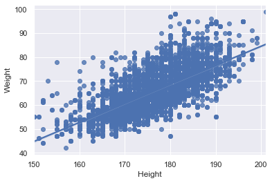
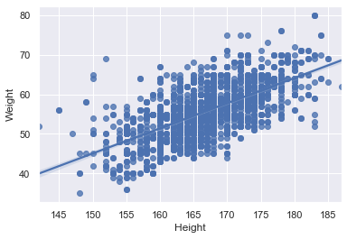

# Optimal BMI for runners

## Intro

In this project we analyse data from elite athletes and give you an estimate of the optimal BMI (relation between height and weight) to enhance your running performance. We looked at the data from actual Olympic athletes so you don't have to, and here's how it looked like:
    

  

But worry not, we've got you. Let's unpack this and make it useful for you!

## What did we do?

What we realised during our investigation is that there is a relation between, for example, the distance run and the BMI of the elite athletes: as distances get longer, the BMI of the professionals gets lower. But, how much lower? That's what we looked into and thanks to our analysis we developed a weight suggestor tool for runners looking to achieve that optimal BMI, copying the best in the sport.

So, for example, say we have 2 runners, Anna and Dave. Anna is 23, she's 160cm tall and she's training for 200m sprints, our weight suggestor tool would say that her optimal running BMI would be attained at 52.6kg or, at least, somewhere between 48.8kg and 56.4kg. In Dave's case, he's 27, 175cm tall and he's training for 10km races, our weight suggestor tool would recommend for his weight to be in the range between 56.6kg and 64.2 with his optimal weight being 60.4kg.

## Why should you care?

Well, you read all the way here so you're at least intrigued. It turns out your weight plays a role in your running performance. Marathoners are leaner than sprinters, helping them distribute oxygen through their muscles more efficiently in the long run :upside_down_face:; while sprinters are more muscular, helping them achieve higher speeds in shorter time. If you're looking to improve your times and achieve your running goals, you may want to look into factors like your weight, for example, what we do here for you :smile:.

## How can you use this information?

So, how can you use this information to improve your performance? Click on the Binder badge below to launch a Jupyter notebook where you can input your age, sex, height and the distance you're training for and we'll guide you through it:

## We hope you liked it!

We hope you liked our work and found it interesting. Good luck in your running training!

By Ainhoa Hernández Serrano, Nico Sterling and Diogo Dias.
